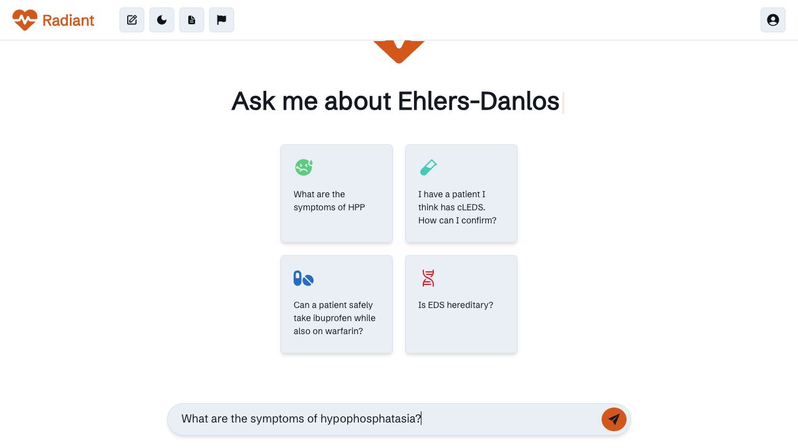
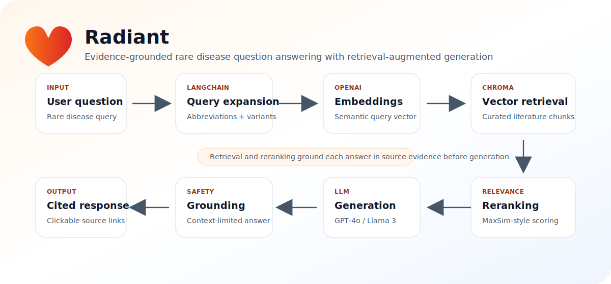

<p align="center">
  
</p>

<h1 align="center">Radiant</h1>

<p align="center">
  <strong>An evidence-grounded RAG chat agent for rare disease knowledge exploration.</strong>
</p>

<p align="center">
  <a href="https://radiant.rtx.ai">Live site</a> |
  <a href="https://link.springer.com/chapter/10.1007/978-3-031-95841-0_35">Springer AIME 2025 paper</a> |
  <a href="docs/ARCHITECTURE.md">Architecture</a> |
  <a href="docs/VERIFICATION.md">Verification</a>
</p>

Radiant is a retrieval-augmented chat agent for rare disease knowledge exploration. It combines query expansion, vector search, document reranking, and large language model generation to answer rare disease questions with links back to retrieved source material.

Project website: [radiant.rtx.ai](https://radiant.rtx.ai)

Paper: [Using AI to Improve Diagnosis and Treatment of Rare Diseases: A Chat Agent for Equitable and Accessible Healthcare](https://link.springer.com/chapter/10.1007/978-3-031-95841-0_35)

This project was presented at the Rare Disease AI Hackathon at GitHub HQ in San Francisco, sponsored by Research to the People. Radiant was also accepted into Oregon State University's Advantage Accelerator program and is described in the Springer AIME 2025 proceedings.

> Repository scope: the latest deployed Radiant production system is separate from this public repository. This repository contains an earlier open-source implementation of the RAG prototype: Flask backend, Angular frontend, Chroma retrieval, LangChain query processing, OpenAI generation/embeddings, and Amazon Bedrock Llama generation.

> Medical safety note: this project is an experimental research prototype. It is not a medical device, does not provide medical diagnosis or treatment, and should not be used as a substitute for advice from qualified clinicians.

## Live Interface



## Architecture



## What It Does

- Expands user questions into related biomedical search queries.
- Embeds expanded queries with OpenAI embeddings.
- Retrieves candidate passages from a Chroma vector database.
- Reranks retrieved passages with a MaxSim-style reranker.
- Generates responses with GPT-4o or Llama 3 through Amazon Bedrock.
- Returns source URLs from the retrieved documents when available.
- Maintains a compact conversation summary for follow-up questions.

## Published And Public Context

- Springer AIME 2025 paper: Radiant is described as an LLM/RAG chat agent with a domain-specific vector database, clickable primary-source references, and reranking to reduce hallucination and overgeneralization risk.
- Oregon State University story: Radiant is described as an AI chatbot for rare disease diagnosis support, backed by curated biomedical literature, source citations, AWS Bedrock, and AWS/Advantage Accelerator support.
- Resume/project source of truth: broader Radiant work includes a full RAG pipeline using LLaMA 3.1 405B, OpenAI embeddings, ChromaDB, approximately 50,000 curated articles, 20 rare genetic diseases, AWS deployment, and latency work with ONNX and FP16 quantization.
- Public live site: `radiant.rtx.ai` currently serves a separate Vite/React 18 app with guest and authenticated chat flows. This repo's open-source frontend is Angular.

## Tech Stack

- Backend: Python, Flask, OpenAI, Amazon Bedrock, Chroma, LangChain
- Frontend: Angular
- Retrieval: OpenAI embeddings, Chroma vector search, MaxSim-style reranking
- Example/evaluation assets: PDF questions and CSV response files

## Repository Layout

```text
.
├── app.py                         # Flask API used by the frontend
├── query_processing/              # RAG pipeline modules
│   ├── database_retrieval.py      # Embedding and Chroma retrieval helpers
│   ├── generation.py              # GPT and Llama response generation
│   ├── query_expansion.py         # Abbreviation expansion and paraphrasing
│   ├── query_processor.py         # End-to-end query pipeline
│   ├── reranker.py                # MaxSim document reranking
│   └── summarizer.py              # Follow-up context summarization
├── frontend/                      # Angular chat interface
├── docs/                          # Architecture and verification notes
├── Examples/                      # Example evaluation queries and responses
├── static/ and templates/         # Legacy Flask static/template files
└── requirements.txt               # Python backend dependencies
```

## System Requirements

- Python 3.10+
- Node.js 18+ and npm
- A running Chroma server on `localhost:8000`
- OpenAI API credentials
- AWS credentials with access to the Bedrock model configured in `query_processing/generation.py`

The backend expects a Chroma collection named `vector-store-rare-diseases1` with document text, embeddings, and metadata that includes `URL` when citation links are available. This repository does not include the private/production vector database or source corpus.

## Backend Setup

```bash
git clone https://github.com/axay28/Radiant.git
cd Radiant
python3 -m venv .venv
source .venv/bin/activate
pip install -r requirements.txt
cp .env.example .env
export OPENAI_API_KEY="your-openai-api-key"
export AWS_REGION="your-aws-region"
flask --app app run
```

If you use the older `OPENAI_API` environment variable elsewhere, keep it in sync with `OPENAI_API_KEY`. The current OpenAI SDK reads `OPENAI_API_KEY` by default.

## Frontend Setup

```bash
cd frontend
npm install
npm start
```

The Angular app runs at `http://localhost:4200/` by default. The Flask backend runs at `http://localhost:5000/` by default.

## Current Verification Status

- Python syntax check passes.
- Angular production build passes after `npm ci`.
- Full end-to-end RAG requires OpenAI credentials, AWS Bedrock access, a running Chroma server, and the populated `vector-store-rare-diseases1` collection.
- A live-site guest API probe on June 17, 2026 reached `radiant.rtx.ai` but returned an application-level generation error. See [docs/VERIFICATION.md](docs/VERIFICATION.md) for details.

## API

`POST /get_response`

Request body:

```json
{
  "modelSelection": "gpt",
  "userQuery": "What are symptoms of hypophosphatasia?",
  "currentSummary": ""
}
```

`modelSelection` may be `gpt`, `llama`, or any other value to request both configured models.

## Paper

For more background, see the Springer conference paper: [Using AI to Improve Diagnosis and Treatment of Rare Diseases: A Chat Agent for Equitable and Accessible Healthcare](https://link.springer.com/chapter/10.1007/978-3-031-95841-0_35).

## Additional Documentation

- [Architecture](docs/ARCHITECTURE.md)
- [Verification notes](docs/VERIFICATION.md)

## Development Notes

- Do not commit generated dependency folders such as `node_modules/`, Angular `.angular/` cache files, virtual environments, or local OS files.
- Example CSV/PDF files are included for reproducibility and evaluation context.
- The notebook is exploratory and may require model downloads or GPU resources.
- If documenting production-only features such as authentication, chat-history persistence, SQLite, or deployment internals, keep them clearly separate from this open-source prototype unless the corresponding code is added here.

## Contact

For inquiries or collaboration, contact [mulgunda@oregonstate.edu](mailto:axay28@gmail.com).

## Citation And Project Context

If you use this repository in research or demos, cite the related Radiant work and link back to the public repository:

```text
Hodges, F.M., Pullela, S., Cohen, G., Mulgund, A., Roach, J.C., Ramsey, S.A. (2025).
Using AI to Improve Diagnosis and Treatment of Rare Diseases: A Chat Agent for Equitable and Accessible Healthcare.
In: Bellazzi, R., Juarez Herrero, J.M., Sacchi, L., Zupan, B. (eds) Artificial Intelligence in Medicine.
AIME 2025. Lecture Notes in Computer Science, vol 15735. Springer, Cham.
https://doi.org/10.1007/978-3-031-95841-0_35

Code: https://github.com/axay28/Radiant
```
